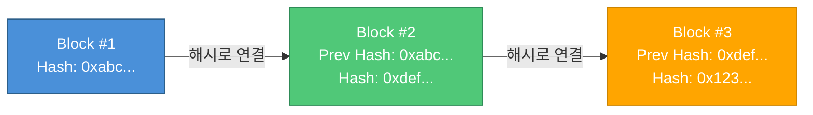
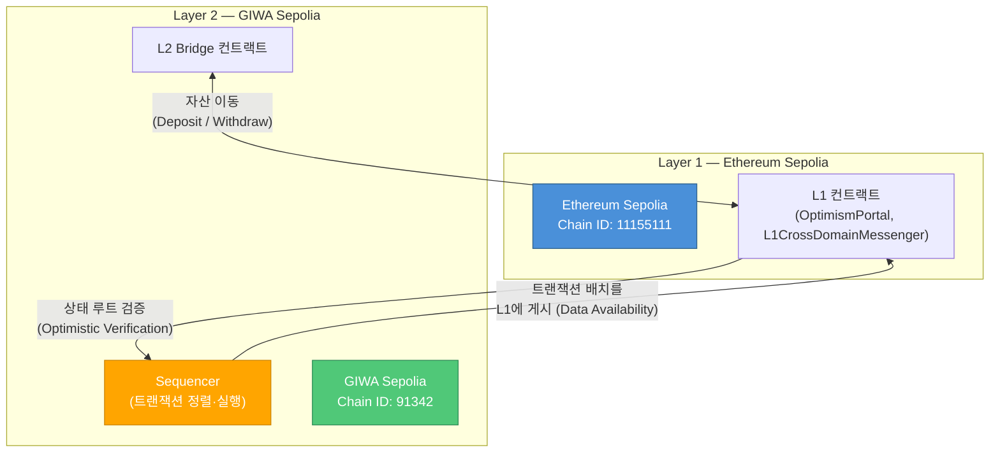
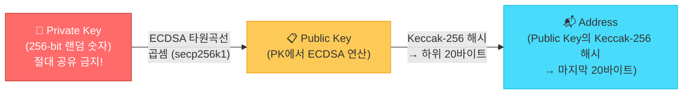

# 01. 기초: 블록체인과 GIWA

> [!info] 학습 목표
> 블록체인의 기본 개념을 이해하고, GIWA Sepolia 테스트넷 환경을 직접 설정할 수 있다.

> [!tip] 이 문서의 관통 비유: "우체국 시스템"
> 이 문서에서는 블록체인을 **우체국 시스템**에 비유하여 설명한다. 머릿속에 이 그림을 그려두자.
>
> | 블록체인 개념 | 우체국 비유 |
> |-------------|-----------|
> | **블록체인** | 모든 배달 기록이 공개된 우체국 네트워크 |
> | **블록** | 하루치 배달 기록을 묶은 파일 |
> | **해시** | 파일의 위조 방지 봉인 도장 |
> | **지갑** | 내 사서함 열쇠 (사서함 = 주소, 열쇠 = 개인키) |
> | **트랜잭션** | 배달 요청서 (보내는 사람, 받는 사람, 내용물) |
> | **노드** | 각 지역 우체국 (모두 같은 배달 기록을 보관) |

---

## 1. 왜 블록체인이 만들어졌는가?

> [!question] 왜 이걸 알아야 하는가?
> "왜" 만들어졌는지 모르면, "무엇"인지도 와닿지 않는다. 배경을 알아야 블록체인의 설계 철학이 이해된다.

### 기존 시스템의 문제점

우리가 돈을 보낼 때, 항상 **중개자(은행, 카드사 등)**를 거친다. 이 구조에는 세 가지 근본적인 문제가 있다.

| 문제 | 설명 | 예시 |
|------|------|------|
| **신뢰 문제** | 중개자가 정직하다고 "믿어야만" 한다 | 은행이 장부를 조작하면 알 수 없다 |
| **단일 장애점** | 중개자가 망가지면 전체가 멈춘다 | 은행 서버 다운 → 송금 불가 |
| **높은 수수료** | 중개자가 수익을 가져간다 | 해외 송금 수수료 수만 원 |

### 비트코인의 탄생

2008년 글로벌 금융위기 때 은행들이 무분별한 대출로 경제를 붕괴시켰다. 사람들은 "은행을 정말 믿을 수 있는가?"라는 의문을 품었다. 이때 **사토시 나카모토**라는 익명의 인물이 비트코인 백서를 발표했다 — **"중개자 없이 개인 간(P2P) 직접 거래할 수 있는 전자화폐 시스템"**.

> [!tip] 비유: 마을 장부
> 마을에 이장(은행)이 혼자 장부를 관리한다고 하자. 이장이 몰래 장부를 고치면 아무도 모른다.
>
> 그런데 **마을 사람 100명이 모두 같은 장부 사본을 갖고 있다면?** 이장이 자기 장부를 고쳐도, 나머지 99명의 장부와 다르기 때문에 즉시 들킨다.
>
> 이것이 블록체인의 핵심 아이디어다 — **모든 참여자가 같은 기록을 공유하면, 누구도 조작할 수 없다.**

> [!tip] [우체국 비유]
> 기존 시스템: 중앙 우체국 하나가 모든 배달 기록을 독점 관리 → 그 우체국이 기록을 조작하거나 문을 닫으면 끝.
>
> 블록체인: **모든 지역 우체국이 동일한 배달 기록을 보관** → 한 곳이 기록을 고쳐도 나머지와 다르기 때문에 무효화.

---

## 2. 블록체인이란?

### 핵심 개념 세 가지

| 개념 | 설명 |
|------|------|
| **원장 (Ledger)** | 모든 거래 기록이 담긴 장부 |
| **분산 (Distributed)** | 수천 개의 노드가 동일한 장부를 보관 |
| **불변성 (Immutable)** | 한 번 기록되면 수정·삭제가 사실상 불가능 |

> [!tip] 비유로 이해하기
> **"공유 구글 시트인데, 수정이 불가능한 것"**
>
> - 구글 시트 → 모든 참여자가 같은 데이터를 본다 (분산)
> - 수정 불가 → 한 번 기록된 행(row)은 절대 고칠 수 없다 (불변성)
> - 새 행만 추가 가능 → 이전 기록을 덮어쓰지 않고, 새 트랜잭션으로 상태를 업데이트

### 해시(Hash)란?

> [!question] 왜 이걸 알아야 하는가?
> 블록 구조를 이해하려면 "해시"가 뭔지 먼저 알아야 한다. 해시는 블록체인의 위변조 방지 핵심 기술이다.

**해시 함수**란, 어떤 데이터를 넣든 **고정된 길이의 "지문"**을 만들어내는 함수다.

> [!tip] 비유: 사람 지문
> 모든 사람의 지문이 다르듯, 모든 데이터의 해시값도 다르다. 데이터가 아무리 길어도 (소설 한 권이라도) 해시값의 길이는 항상 동일하다.

> [!tip] [우체국 비유]
> 해시 = 파일의 **위조 방지 봉인 도장**. 하루치 배달 기록 파일에 봉인 도장을 찍어두면, 누군가 기록을 고쳤을 때 도장이 맞지 않아 즉시 발각된다.

**핵심 특성: 눈사태 효과** — 입력값을 1글자만 바꿔도 해시가 **완전히** 달라진다.

| 입력 | 해시 출력 (SHA-256, 앞부분만 표시) |
|------|------|
| `"Hello"` | `0x185f8db3...` |
| `"Hello!"` | `0x33b4c571...` (완전히 다른 값!) |
| `"hello"` | `0x2cf24dba...` (대소문자만 달라도 완전히 다름) |

**블록체인에서 해시의 역할:**
- 각 블록은 자기만의 해시(지문)를 갖는다
- 블록 안의 데이터가 1비트라도 바뀌면 → 해시가 완전히 달라짐 → **위변조 즉시 감지**
- 다음 블록은 이전 블록의 해시를 포함 → **체인처럼 연결** → 과거 블록을 고치면 그 이후 모든 블록의 해시가 깨짐



### 블록의 구조

```
┌─────────────────────────┐
│ Block #N                │
│ ─────────────────────── │
│ Previous Hash: 0xabc... │  ← 이전 블록과의 연결고리
│ Timestamp: 1709712000   │
│ Transactions:           │
│   - Alice → Bob: 1 ETH  │
│   - Carol → Dave: 0.5   │
│ Nonce: 42               │
│ Hash: 0xdef...          │  ← 이 블록의 고유 지문
└─────────────────────────┘
```

---

## 3. 이더리움과 테스트넷

### 이더리움 vs 비트코인

> [!question] 왜 이걸 알아야 하는가?
> 우리가 배울 GIWA는 이더리움 기반이다. 비트코인과 뭐가 다른지 알아야 "왜 이더리움을 쓰는지" 이해할 수 있다.

| 구분 | 비트코인 | 이더리움 |
|------|---------|---------|
| **한 줄 요약** | 디지털 **화폐** | 디지털 **컴퓨터** |
| **할 수 있는 것** | 송금만 가능 | 송금 + **프로그램 실행** |
| **핵심 기능** | A가 B에게 돈 보내기 | A가 B에게 돈 보내기 + **스마트 컨트랙트** |

**스마트 컨트랙트**란? 조건이 충족되면 **자동으로 실행되는 코드**다.

> [!tip] 비유: 자판기
> 자판기에 동전을 넣고 버튼을 누르면 음료가 나온다 — 점원이 필요 없다. 스마트 컨트랙트도 마찬가지다. 조건(동전 투입 + 버튼)이 충족되면, 중개자 없이 코드가 **자동으로** 결과(음료 배출)를 실행한다.

### 메인넷 vs 테스트넷

| 구분 | 메인넷 (Mainnet) | 테스트넷 (Testnet) |
|------|------------------|-------------------|
| **ETH 가치** | 실제 돈 (수백만 원) | 무료 (가치 없음) |
| **용도** | 실제 서비스 배포 | 개발·학습·테스트 |
| **실수 비용** | 되돌릴 수 없는 자산 손실 | 없음 (다시 받으면 됨) |
| **네트워크** | Ethereum Mainnet | Sepolia, Holesky 등 |

> [!warning] 왜 테스트넷을 써야 하는가?
> 메인넷에서 실수하면 **실제 돈을 잃는다.** 스마트 컨트랙트 배포에 수십~수백 달러가 들 수 있고, 버그가 있는 컨트랙트는 되돌릴 수 없다. 학습 단계에서는 **반드시** 테스트넷을 사용하자.

---

## 4. GIWA Sepolia 소개

**GIWA Sepolia**는 **OP Stack** 기반의 **Layer 2 (L2)** 테스트넷이다.

| 항목 | 값 |
|------|-----|
| **Chain ID** | `91342` (hex: `0x164CE`) |
| **기반** | OP Stack (Optimistic Rollup) |
| **L1** | Ethereum Sepolia |
| **RPC URL** | `https://sepolia-rpc.giwa.io/` |
| **Explorer** | `https://sepolia-explorer.giwa.io` |

### L1과 L2의 관계



> [!info] OP Stack이란?
> Optimism 팀이 만든 **모듈형 L2 프레임워크**다. 누구나 이 스택을 사용해 자신만의 L2 체인을 만들 수 있다. GIWA Sepolia도 이 프레임워크 위에 구축되었다.

---

## 5. 지갑과 계정

### "지갑은 돈을 담는 곳이 아니다"

> [!question] 왜 이걸 알아야 하는가?
> "지갑에 코인이 들어있다"는 것은 가장 흔한 오해다. 이걸 잘못 이해하면 개인키 관리의 중요성을 놓치게 된다.

> [!warning] 흔한 오해
> "내 MetaMask 지갑 안에 ETH가 들어있다" → **틀렸다!**

**실제로는 이렇다:**
- 코인은 **블록체인(공유 장부)** 위에 기록되어 있다
- 지갑은 그 기록에 **접근할 수 있는 열쇠꾸러미**일 뿐이다
- 지갑을 삭제해도 코인은 블록체인 위에 그대로 남아있다 (개인키만 있으면 복구 가능)

> [!tip] 비유: 은행 계좌
> 돈은 **은행(블록체인)**에 있고, 통장이나 카드(지갑)는 **접근 수단**일 뿐이다. 통장을 잃어버려도 돈이 사라지는 건 아니다 — 비밀번호(개인키)만 있으면 새 통장을 발급받을 수 있다.

> [!tip] [우체국 비유]
> 내 우편물(코인)은 **사서함(블록체인 주소)** 안에 있다. 지갑은 **사서함 열쇠**다. 열쇠를 잃어버리면 우편물에 접근할 수 없지만, 우편물 자체는 사서함 안에 그대로 있다.

**용어 대응표:**

| 블록체인 용어 | 은행 비유 | 역할 |
|-------------|---------|------|
| **개인키 (Private Key)** | 비밀번호 | 거래를 승인하는 유일한 수단. 절대 공유 금지 |
| **공개키 (Public Key)** | 계좌번호 | 개인키로부터 수학적으로 생성됨 |
| **주소 (Address)** | 축약된 계좌번호 | 공개키를 해시하여 줄인 것. 다른 사람에게 알려줘도 안전 |

### 키 유도 과정

이더리움 계정은 **개인키(Private Key)** 에서 시작하여 순서대로 파생된다.



> [!warning] 개인키 관리
> - **절대 타인에게 공유하지 마라**
> - `.env` 파일에 보관하고, `.gitignore`에 반드시 추가
> - 테스트넷용 계정과 메인넷용 계정을 **반드시 분리**

### 요약

```
Private Key (비밀)
    ↓ ECDSA secp256k1
Public Key (공개 가능)
    ↓ Keccak-256 → 마지막 20바이트
Address (0x로 시작하는 42자리 문자열)
```

---

## 6. ETH 단위 체계: wei / gwei / ether

> [!question] 왜 이걸 알아야 하는가?
> 트랜잭션을 보내거나 Gas 비용을 이해하려면 ETH의 단위 체계를 알아야 한다. 코드에서 숫자가 엄청 클 때 당황하지 않으려면 이 섹션을 꼭 읽자.

### ETH의 최소 단위: wei

ETH는 소수점 이하 **18자리**까지 표현할 수 있다. 가장 작은 단위를 **wei**라고 한다.

> [!tip] 비유: 원과 전, 미터와 밀리미터
> - 1원 = 100전 (옛날 화폐 단위)
> - 1m = 100cm = 1,000mm
> - 1 ETH = 1,000,000,000,000,000,000 wei (10^18)

### 단위 변환 테이블

| 단위 | wei 환산 | 지수 표기 | 주요 용도 |
|------|---------|----------|----------|
| **wei** | 1 wei | 10^0 | 최소 단위, 스마트 컨트랙트 내부 연산 |
| **gwei** | 1,000,000,000 wei | 10^9 | **Gas 가격** 표시에 주로 사용 |
| **ether (ETH)** | 1,000,000,000,000,000,000 wei | 10^18 | 일반적인 잔액·송금 금액 표시 |

```
1 ETH = 1,000,000,000 gwei = 1,000,000,000,000,000,000 wei
         (10억 gwei)           (100경 wei)
```

> [!info] 왜 이렇게 작은 단위가 필요한가?
> ETH 1개의 가격이 수백만 원이라면, 커피 한 잔 값(5,000원)을 보내려면 **0.001 ETH** 같은 아주 작은 소수가 필요하다. 컴퓨터는 소수점 연산에서 오차가 생길 수 있기 때문에, 블록체인에서는 **모든 금액을 정수(wei)**로 처리하고, 사람에게 보여줄 때만 ETH로 변환한다.

> [!tip] 실무에서 자주 보는 예
> - MetaMask에서 Gas 가격: **20 gwei** (= 20,000,000,000 wei)
> - 송금 금액: **0.01 ETH** (= 10,000,000,000,000,000 wei)
> - 스마트 컨트랙트 코드에서: `msg.value`는 항상 **wei 단위**

---

## 7. Faucet이란?

**Faucet(수도꼭지)** 은 테스트넷 ETH를 **무료로** 지급하는 서비스다.

> [!tip] GIWA Sepolia Faucet 목록
>
> | Faucet | 지급량 | 제한 | URL |
> |--------|--------|------|-----|
> | **GIWA 공식** | 0.005 ETH | 24시간당 1회 | [faucet.giwa.io](https://faucet.giwa.io) |
> | **Lambda256** | 0.01 ETH | 24시간당 1회 | [faucet.lambda256.io/giwa-sepolia](https://faucet.lambda256.io/giwa-sepolia) |

### Faucet 사용 절차

1. MetaMask에서 **GIWA Sepolia** 네트워크로 전환
2. 자신의 지갑 주소(`0x...`)를 복사
3. 위 Faucet 사이트에 접속 → 주소 붙여넣기 → 요청
4. 1~2분 내에 테스트 ETH 수신 확인

> [!info] 두 Faucet을 모두 사용하면?
> 24시간 내에 총 **0.015 ETH**를 확보할 수 있다. 실습에 충분한 양이다.

---

## 8. 개발 환경 사전 지식

> [!question] 왜 이걸 알아야 하는가?
> 다음 섹션에서 MetaMask 설정 외에도 코드 기반 실습을 하게 된다. 아래 도구들이 뭔지 모르면 실습을 따라갈 수 없다.

| 도구 | 한 줄 설명 |
|------|-----------|
| **Node.js** | JavaScript를 브라우저 밖(내 컴퓨터)에서 실행할 수 있게 해주는 도구 |
| **npm** | Node.js 패키지(남이 만든 라이브러리)를 설치·관리하는 도구. `npm install` 명령으로 사용 |
| **.env 파일** | 비밀번호, 개인키 같은 민감 정보를 코드에 직접 쓰지 않고 **별도 파일에 보관**하는 방법 |
| **터미널** | 명령어를 텍스트로 입력하여 컴퓨터를 조작하는 도구. Windows에서는 Git Bash, PowerShell 등을 사용 |

> [!warning] .env 파일 주의사항
> `.env` 파일에는 개인키(`PRIVATE_KEY=0x...`) 같은 민감 정보가 들어간다. 이 파일은 **절대 GitHub에 올리면 안 된다.** 프로젝트의 `.gitignore` 파일에 `.env`를 반드시 추가하자.

```bash
# .env 파일 예시
PRIVATE_KEY=0xabc123...    # 내 지갑 개인키 (절대 공유 금지)
RPC_URL=https://sepolia-rpc.giwa.io/
```

```bash
# .gitignore 파일에 추가
.env
```

---

## 9. 실습 환경 설정: MetaMask에 GIWA 추가

### Step-by-Step

**① MetaMask 설치**
- [metamask.io](https://metamask.io)에서 브라우저 확장 프로그램 설치
- 새 지갑 생성 또는 기존 지갑 가져오기

**② GIWA Sepolia 네트워크 수동 추가**

MetaMask → 네트워크 추가 → 수동으로 네트워크 추가:

| 항목 | 값 |
|------|-----|
| **네트워크 이름** | GIWA Sepolia |
| **RPC URL** | `https://sepolia-rpc.giwa.io/` |
| **Chain ID** | `91342` (입력 시 hex `0x164CE`로 자동 변환) |
| **통화 기호** | `ETH` |
| **블록 탐색기 URL** | `https://sepolia-explorer.giwa.io` |

**③ 네트워크 전환 확인**
- MetaMask 상단에서 "GIWA Sepolia"가 표시되는지 확인
- 잔액이 `0 ETH`로 표시되면 정상

**④ Faucet에서 테스트 ETH 수령**
- 위 Section 7의 Faucet을 사용하여 ETH 수령

> [!tip] 확인 방법
> [GIWA Explorer](https://sepolia-explorer.giwa.io)에서 자신의 주소를 검색하면 잔액과 트랜잭션 내역을 확인할 수 있다.

---

## 10. 핵심 용어 정리

| 용어 | 설명 |
|------|------|
| **블록** | 트랜잭션의 묶음. 이전 블록의 해시를 포함하여 체인을 형성 |
| **해시** | 데이터의 고유 지문. 입력이 조금만 달라져도 완전히 다른 값이 나온다 |
| **노드** | 블록체인 네트워크에 참여하는 컴퓨터 |
| **트랜잭션 (TX)** | 블록체인 상의 상태 변경 요청 (송금, 컨트랙트 호출 등) |
| **스마트 컨트랙트** | 조건이 충족되면 자동으로 실행되는 블록체인 위의 프로그램 |
| **Gas** | EVM 연산 비용 단위. 다음 문서에서 심화 학습 |
| **Nonce** | 계정별 트랜잭션 순번. 다음 문서에서 심화 학습 |
| **wei / gwei / ETH** | ETH의 단위. 1 ETH = 10^9 gwei = 10^18 wei |
| **L1 / L2** | Layer 1(메인체인) / Layer 2(확장 체인) |
| **Faucet** | 테스트넷 토큰을 무료로 지급하는 서비스 |

---

## 다음 단계

기초 개념을 이해했다면, 트랜잭션의 핵심 구성 요소인 **Nonce, Gas, Signature**를 심화 학습하자.

👉 [[02-중급-Nonce-Gas-Signature]]
