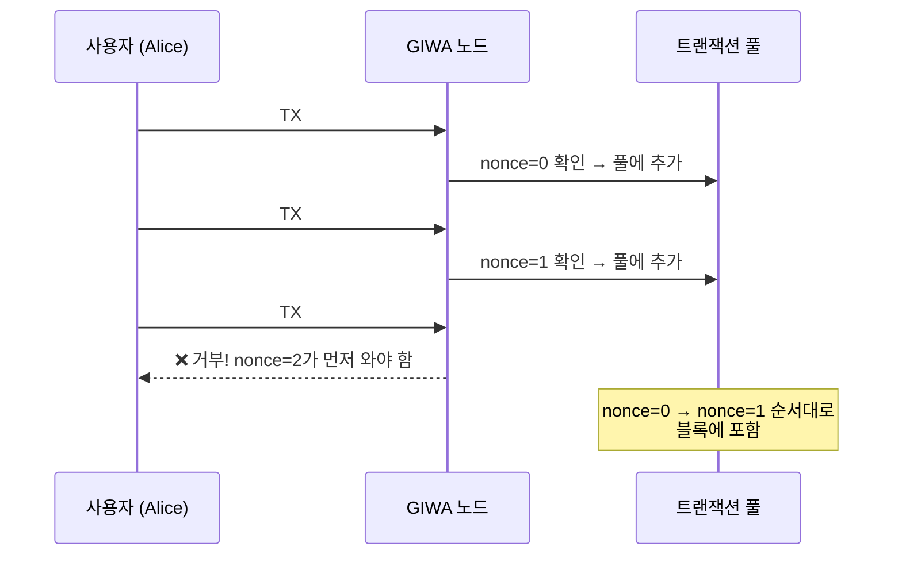
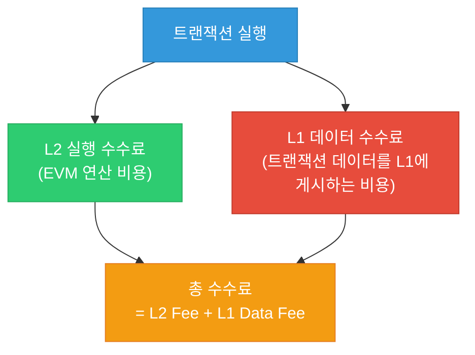
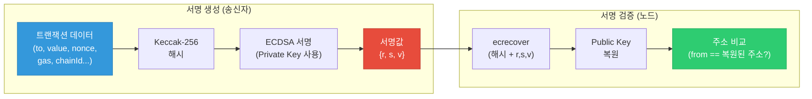
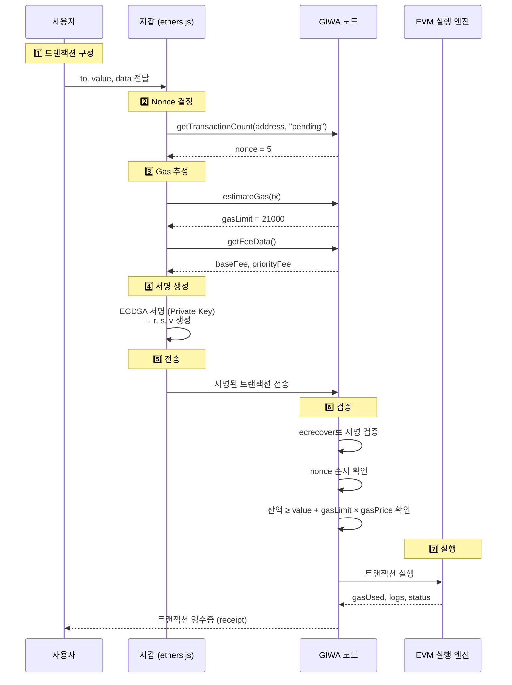

# 02. 중급: Nonce, Gas, Signature

> [!info] 학습 목표
> 트랜잭션의 세 가지 핵심 구성 요소(Nonce, Gas, Signature)를 심화 이해하고, 코드 레벨에서 확인하는 방법을 익힌다.

**사전 학습**: [[01-기초-블록체인과-GIWA]]

> [!tip] 통일 비유: 우체국 시스템
> 이 문서에서 다루는 세 개념을 **우체국 택배 시스템**에 비유하면 직관적으로 이해할 수 있다.
>
> | 개념 | 우체국 비유 | 핵심 역할 |
> |------|------------|-----------|
> | **Nonce** | 택배 송장 일련번호 | 중복 배달 방지, 순서 보장 |
> | **Gas** | 배송비 (무게·거리에 따라 달라짐) | 자원 사용 비용 측정 |
> | **Signature** | 보내는 사람의 위조불가 인감도장 | 본인 인증, 변조 방지 |
>
> 각 섹션에서 이 비유를 다시 떠올리면 개념이 더 쉽게 연결된다.

---

## 1. Nonce 심화

> [!warning] Nonce를 모르면 뭐가 문제인가?
> **실제로 일어나는 사고들:**
> - **트랜잭션이 stuck(멈춤)**: Nonce 3번을 보내야 하는데 실수로 5번을 보냄 → 3, 4번이 빠졌으므로 5번 트랜잭션이 영원히 pending 상태로 대기. 이후 모든 트랜잭션도 줄줄이 막힘.
> - **같은 송금이 두 번 처리됨 (리플레이 공격)**: Nonce가 없던 초기 블록체인에서는 Alice→Bob 1 ETH 전송 트랜잭션을 누군가 복사하여 여러 번 제출할 수 있었다. Nonce 덕분에 **같은 순번의 트랜잭션은 한 번만** 처리된다.
> - **Nonce 충돌로 트랜잭션 덮어쓰기**: DApp에서 빠르게 여러 트랜잭션을 보낼 때, 같은 nonce를 사용하면 나중에 보낸 것이 앞의 것을 대체해버릴 수 있다.
>
> 택배에 비유하면: **송장 일련번호 없이 택배를 보내는 것**과 같다. 같은 택배가 두 번 배달되거나, 순서가 뒤바뀌거나, 어디서 막혔는지 추적조차 못 한다.

### Nonce란?

**Nonce**(Number used ONCE)는 각 계정에서 발생한 트랜잭션의 **순번**이다.

| 속성 | 설명 |
|------|------|
| **시작값** | 0 (첫 트랜잭션) |
| **증가 규칙** | 성공한 트랜잭션마다 +1 |
| **범위** | 계정별 독립 (Alice의 nonce와 Bob의 nonce는 무관) |

### Nonce가 필요한 이유

> [!warning] 리플레이 공격 (Replay Attack) 방지
> Nonce가 없다면, 누군가 Alice→Bob 1 ETH 전송 트랜잭션을 **복사**하여 여러 번 제출할 수 있다. Nonce가 있으면 **같은 nonce의 트랜잭션은 한 번만** 처리되므로 리플레이가 불가능하다.

### 트랜잭션 순서 보장



> [!tip] 핵심 규칙
> - nonce는 **0부터 순차적**으로 사용해야 한다
> - 중간 nonce가 빠지면 이후 트랜잭션은 **대기(pending)** 상태
> - 같은 nonce를 재사용하면 **기존 트랜잭션을 대체** (TX replacement)

### 코드로 Nonce 확인하기

```typescript
// ethers.js v6 기준 — GIWA Sepolia (ES Module 방식)
import { JsonRpcProvider } from "ethers";

const provider = new JsonRpcProvider("https://sepolia-rpc.giwa.io/");

// 특정 주소의 현재 nonce 조회
const address = "0xYourAddressHere";

// 확정된 트랜잭션 기준 nonce
const confirmedNonce = await provider.getTransactionCount(address, "latest");
console.log(`확정 nonce: ${confirmedNonce}`);

// pending 포함 nonce (다음에 사용할 nonce)
const pendingNonce = await provider.getTransactionCount(address, "pending");
console.log(`다음 사용 nonce: ${pendingNonce}`);
```

```javascript
// 실제 프로젝트(CommonJS) 방식
const ethers = require('ethers');

const provider = new ethers.JsonRpcProvider('https://sepolia-rpc.giwa.io/');

const address = '0xYourAddressHere';

// 확정된 트랜잭션 기준 nonce
const confirmedNonce = await provider.getTransactionCount(address, 'latest');
console.log(`확정 nonce: ${confirmedNonce}`);

// pending 포함 nonce (다음에 사용할 nonce)
const pendingNonce = await provider.getTransactionCount(address, 'pending');
console.log(`다음 사용 nonce: ${pendingNonce}`);
```

> [!example] 실습: Nonce 불일치 실험
> 1. 현재 nonce를 조회한다
> 2. nonce를 **일부러 +2**로 설정하여 트랜잭션을 보낸다
> 3. 트랜잭션이 pending 상태로 머무는 것을 확인한다
> 4. 빠진 nonce(+1)에 해당하는 트랜잭션을 보내면, 두 개 모두 처리된다

---

## 2. Gas 심화

> [!warning] Gas를 모르면 뭐가 문제인가?
> **실제로 일어나는 사고들:**
> - **수수료를 너무 적게 설정** → 트랜잭션이 처리되지 않고 mempool에서 무한 대기. 급한 전송인데 몇 시간~며칠째 pending.
> - **수수료를 너무 많이 설정** → 불필요하게 비싼 Gas를 지불하여 돈 낭비. 특히 NFT 민팅 러시 등에서 패닉 상태로 gasPrice를 과도하게 높이는 실수가 흔함.
> - **gasLimit을 너무 낮게 설정** → 트랜잭션 실행 도중 Gas가 바닥나면 **즉시 실패(revert)**. 이때 사용된 Gas는 환불되지 않으므로 수수료만 날리고 아무것도 안 됨.
> - **컨트랙트 호출 시 Gas 추정 실패** → 복잡한 스마트 컨트랙트 함수를 호출할 때 estimateGas를 하지 않으면 `out of gas` 에러로 실패.
>
> 택배에 비유하면: **배송비를 모르고 택배를 보내는 것**과 같다. 배송비를 너무 적게 내면 택배가 출발조차 안 하고, 너무 많이 내면 돈만 낭비한다.

### Gas란?

**Gas**는 EVM(Ethereum Virtual Machine)에서 연산을 수행하는 데 필요한 **비용 단위**다.

> [!info] 왜 Gas가 필요한가?
> - **무한 루프 방지**: Gas가 없으면 악의적 코드가 네트워크를 멈출 수 있다
> - **자원 공정 분배**: 더 많은 연산 = 더 많은 비용
> - **DoS 공격 방지**: 공격 비용을 발생시켜 남용을 억제

### Gas 관련 핵심 용어

| 용어 | 설명 |
|------|------|
| **gasLimit** | 사용자가 허용하는 최대 Gas량 (상한선) |
| **gasUsed** | 실제로 사용된 Gas량 |
| **gasPrice** | Gas 1단위당 가격 (wei) — Legacy 방식 |
| **baseFee** | 네트워크가 결정하는 최소 수수료 (EIP-1559) |
| **priorityFee (tip)** | 사용자가 Sequencer에게 주는 팁 (EIP-1559) |

### EIP-1559 등장 배경

> [!info] 이전 방식의 문제점: First-Price Auction (1차 가격 경매)
> EIP-1559 이전에는 **gasPrice** 하나만 존재했다. 사용자들이 "내 트랜잭션을 먼저 처리해달라"고 **경매처럼 가격을 올리는 방식**이었다.
>
> **문제점:**
> - 적절한 가격을 예측할 수 없음 → "10 Gwei면 될까? 20 Gwei?" 매번 도박
> - 네트워크가 혼잡하면 수수료가 급등 → 2021년 NFT 열풍 때 단순 전송에 수십 달러
> - 같은 블록 안에서도 누구는 10 Gwei, 누구는 100 Gwei를 지불 → 불공평
> - 지갑이 Gas 가격을 추천해도 매번 빗나감

```
이전 방식 (Legacy):
사용자 A: "20 Gwei 낼게!" → 채택 ❌ (너무 낮음)
사용자 B: "50 Gwei 낼게!" → 채택 ✅
사용자 C: "80 Gwei 낼게!" → 채택 ✅ (30 Gwei를 과다 지불...)
→ 가격 예측 불가, 과다 지불 빈번

EIP-1559 이후:
네트워크가 baseFee = 30 Gwei 자동 결정
사용자 A: baseFee(30) + tip(1) = 31 Gwei → 채택 ✅
사용자 B: baseFee(30) + tip(2) = 32 Gwei → 채택 ✅ (tip만큼만 차이)
→ 가격 예측 가능, 공정한 비용
```

> [!tip] 택시 비유로 이해하기
> - **이전 (Legacy)** = **흥정 택시**: 기사마다 다른 가격을 부르고, 손님이 "더 줄게!"하며 경쟁. 바가지를 쓸 수도 있고, 너무 적게 불러서 택시를 못 잡을 수도 있다.
> - **이후 (EIP-1559)** = **미터기 택시**: 기본요금(baseFee)이 정해져 있고, 급하면 팁(priorityFee)을 추가. 기본요금은 도로 혼잡도에 따라 자동 조절된다.

### EIP-1559 수수료 구조

```
총 수수료 = gasUsed × (baseFee + priorityFee)
환불액    = (gasLimit - gasUsed) × gasPrice  ← 남은 Gas는 돌려받음
```

> [!tip] EIP-1559 핵심
> - **baseFee**: 프로토콜이 자동 조절. 블록이 가득 차면 상승, 비면 하락
> - **priorityFee (tip)**: Sequencer가 내 트랜잭션을 먼저 처리하도록 인센티브
> - **maxFeePerGas**: 사용자가 지불할 의사가 있는 최대 가격
> - `maxFeePerGas ≥ baseFee + priorityFee` 이어야 트랜잭션 실행

### L2 수수료 구조 (GIWA Sepolia)

L2에서는 일반 Gas 외에 **L1 데이터 수수료**가 추가된다.



> [!warning] L2에서의 Gas 특징
> - **L2 실행 수수료**는 매우 저렴 (L1의 1/10 ~ 1/100)
> - **L1 데이터 수수료**가 전체 비용의 대부분을 차지
> - 트랜잭션 데이터가 클수록 L1 데이터 수수료가 증가
> - EIP-4844 (Blob) 도입 후 L1 데이터 수수료가 대폭 감소

### 코드로 Gas 정보 확인하기

```typescript
// ethers.js v6 (ES Module 방식)
import { JsonRpcProvider, formatUnits } from "ethers";

const provider = new JsonRpcProvider("https://sepolia-rpc.giwa.io/");

// 현재 네트워크의 수수료 정보 조회
const feeData = await provider.getFeeData();
console.log("baseFee (Gwei):", formatUnits(feeData.gasPrice ?? 0n, "gwei"));
console.log("maxFeePerGas:", formatUnits(feeData.maxFeePerGas ?? 0n, "gwei"));
console.log("maxPriorityFee:", formatUnits(feeData.maxPriorityFeePerGas ?? 0n, "gwei"));

// 특정 트랜잭션의 Gas 사용량 조회
const txHash = "0xYourTxHashHere";
const receipt = await provider.getTransactionReceipt(txHash);
if (receipt) {
  console.log("gasUsed:", receipt.gasUsed.toString());
  console.log("effectiveGasPrice (Gwei):", formatUnits(receipt.gasPrice, "gwei"));
  console.log("실제 수수료 (ETH):", formatUnits(receipt.gasUsed * receipt.gasPrice, "ether"));
}
```

```javascript
// 실제 프로젝트(CommonJS) 방식
const ethers = require('ethers');

const provider = new ethers.JsonRpcProvider('https://sepolia-rpc.giwa.io/');

// 현재 네트워크의 수수료 정보 조회
const feeData = await provider.getFeeData();
console.log('baseFee (Gwei):', ethers.formatUnits(feeData.gasPrice ?? 0n, 'gwei'));
console.log('maxFeePerGas:', ethers.formatUnits(feeData.maxFeePerGas ?? 0n, 'gwei'));
console.log('maxPriorityFee:', ethers.formatUnits(feeData.maxPriorityFeePerGas ?? 0n, 'gwei'));

// 특정 트랜잭션의 Gas 사용량 조회
const txHash = '0xYourTxHashHere';
const receipt = await provider.getTransactionReceipt(txHash);
if (receipt) {
  console.log('gasUsed:', receipt.gasUsed.toString());
  console.log('effectiveGasPrice (Gwei):', ethers.formatUnits(receipt.gasPrice, 'gwei'));
  console.log('실제 수수료 (ETH):', ethers.formatUnits(receipt.gasUsed * receipt.gasPrice, 'ether'));
}
```

### 주요 연산별 Gas 비용

| 연산 | Gas 비용 | 설명 |
|------|----------|------|
| 기본 트랜잭션 | 21,000 | 단순 ETH 전송 |
| SSTORE (새 저장) | 20,000 | 스토리지에 새 값 쓰기 |
| SSTORE (업데이트) | 5,000 | 기존 값 변경 |
| SLOAD | 2,100 | 스토리지에서 값 읽기 |
| CREATE (컨트랙트 배포) | 32,000+ | 바이트코드 크기에 비례 |

---

## 3. Signature 심화

> [!warning] 서명을 모르면 뭐가 문제인가?
> **실제로 일어나는 사고들:**
> - **개인키(Private Key) 유출**: 서명의 원리를 모르면 "Private Key = 절대 공개 불가"라는 것을 진정으로 이해하기 어렵다. Discord DM으로 "지갑 연동을 도와드릴게요, Private Key를 보내주세요"라는 사기에 당한 사례가 수없이 많다.
> - **피싱 서명 (Signature Phishing)**: 악의적 DApp이 "이 메시지에 서명해주세요"라며 사실은 **토큰 전송 승인(approve)** 트랜잭션에 서명하도록 유도. 사용자는 무해한 메시지라고 생각했지만, 서명 한 번으로 지갑의 모든 토큰이 탈취됨.
> - **서명 재사용 (Replay Attack)**: 서명 구조(특히 chainId, nonce)를 이해하지 못하면, 한 체인에서의 서명이 다른 체인에서 재사용될 수 있다는 위험을 모른다.
>
> 택배에 비유하면: **인감도장 관리를 소홀히 하는 것**과 같다. 인감도장이 유출되면 누군가 내 이름으로 택배를 보내고, 계약을 체결할 수 있다.

### ECDSA란?

**ECDSA**(Elliptic Curve Digital Signature Algorithm)는 이더리움이 사용하는 **전자 서명 알고리즘**이다.

> [!info] 서명의 역할
> 1. **인증 (Authentication)**: "이 트랜잭션은 정말 내가 보낸 것이다"
> 2. **무결성 (Integrity)**: "트랜잭션 내용이 변조되지 않았다"
> 3. **부인 방지 (Non-repudiation)**: "보낸 사람이 나중에 '나 아님' 주장 불가"

### 타원곡선의 직관적 이해

> [!tip] 수학을 모르는 초보자를 위한 비유: "색 섞기"
>
> 타원곡선 암호가 왜 안전한지, 수학 없이 비유로 이해해보자.
>
> **색 섞기 비유:**
> - 빨강 + 파랑 = **보라**를 만드는 것은 **쉽다** (누구나 할 수 있다)
> - 하지만 보라를 보고 **"원래 빨강과 파랑이었다"를 알아내는 것은 불가능**하다
>   (보라를 만드는 색 조합은 무한히 많기 때문)
>
> 타원곡선도 마찬가지다:
> ```
> Private Key → Public Key   (쉬움: 한 방향 계산)
> Public Key → Private Key   (사실상 불가능: 역방향 계산 불가)
> ```
>
> | 방향 | 색 비유 | 타원곡선 | 난이도 |
> |------|---------|----------|--------|
> | 순방향 | 빨강 + 파랑 → 보라 | Private Key → Public Key | 컴퓨터로 즉시 계산 |
> | 역방향 | 보라 → 빨강? 파랑? | Public Key → Private Key | 우주 나이만큼 시간 필요 |
>
> 이것이 **비대칭 암호(Asymmetric Cryptography)**의 핵심이다:
> - **Private Key**(비밀키): 나만 알고 있는 "원래 색"
> - **Public Key**(공개키): 누구나 볼 수 있는 "섞인 색"
> - 공개키를 공개해도 비밀키는 안전하다. 섞인 색에서 원래 색을 분리할 수 없기 때문이다.

### 서명 프로세스



### r, s, v 값의 의미

| 값 | 의미 | 크기 |
|----|------|------|
| **r** | 서명 과정에서 생성된 타원곡선 위의 점의 x좌표 | 32 bytes |
| **s** | 서명의 수학적 증명값 (r과 Private Key로 계산) | 32 bytes |
| **v** | 복구 식별자 (Recovery ID). Public Key 복원 시 2개의 후보 중 올바른 것을 선택 | 1 byte (27 or 28, EIP-155 적용 시 chainId 기반 계산) |

> [!tip] EIP-155와 chainId
> v 값에 chainId를 포함시켜, **다른 체인에서 서명을 재사용하는 것을 방지**한다.
> ```
> v = recoveryId + 27                          // Legacy
> v = recoveryId + chainId * 2 + 35            // EIP-155
> // GIWA Sepolia (chainId=91342)인 경우:
> // v = 0 + 91342 * 2 + 35 = 182719 또는 182720
> ```

### ecrecover 검증 원리

```
1. 노드가 수신한 트랜잭션: {nonce, to, value, gas, data, v, r, s}
2. 트랜잭션 데이터(v,r,s 제외)를 해시: msgHash = keccak256(RLP(tx_data))
3. ecrecover(msgHash, v, r, s) → Public Key 복원
4. 복원된 Public Key → Address 변환
5. 변환된 Address == 트랜잭션의 from 필드 → ✅ 유효한 서명
```

### 코드로 서명 생성 및 검증

```typescript
// ethers.js v6 (ES Module 방식)
import { Wallet, JsonRpcProvider, parseEther } from "ethers";

const provider = new JsonRpcProvider("https://sepolia-rpc.giwa.io/");
const wallet = new Wallet("0xYourPrivateKeyHere", provider);

// 트랜잭션 서명 및 전송
const tx = await wallet.sendTransaction({
  to: "0xRecipientAddress",
  value: parseEther("0.001"),
  chainId: 91342n,
});

console.log("TX Hash:", tx.hash);
console.log("서명값:");
console.log("  r:", tx.signature.r);
console.log("  s:", tx.signature.s);
console.log("  v:", tx.signature.v);

// 트랜잭션 수신 대기
const receipt = await tx.wait();
console.log("블록 번호:", receipt?.blockNumber);
console.log("상태:", receipt?.status === 1 ? "성공" : "실패");
```

```javascript
// 실제 프로젝트(CommonJS) 방식
const ethers = require('ethers');

const provider = new ethers.JsonRpcProvider('https://sepolia-rpc.giwa.io/');
const wallet = new ethers.Wallet('0xYourPrivateKeyHere', provider);

// 트랜잭션 서명 및 전송
const tx = await wallet.sendTransaction({
  to: '0xRecipientAddress',
  value: ethers.parseEther('0.001'),
  chainId: 91342n,
});

console.log('TX Hash:', tx.hash);
console.log('서명값:');
console.log('  r:', tx.signature.r);
console.log('  s:', tx.signature.s);
console.log('  v:', tx.signature.v);

// 트랜잭션 수신 대기
const receipt = await tx.wait();
console.log('블록 번호:', receipt?.blockNumber);
console.log('상태:', receipt?.status === 1 ? '성공' : '실패');
```

> [!example] 서명 검증 실습
> ```typescript
> // ES Module 방식
> import { verifyMessage, hashMessage } from "ethers";
>
> // 메시지 서명 (트랜잭션이 아닌 임의 메시지)
> const message = "Hello GIWA!";
> const signature = await wallet.signMessage(message);
> console.log("서명:", signature);
>
> // 서명에서 주소 복원
> const recoveredAddress = verifyMessage(message, signature);
> console.log("복원된 주소:", recoveredAddress);
> console.log("일치 여부:", recoveredAddress === wallet.address);
> ```
>
> ```javascript
> // 실제 프로젝트(CommonJS) 방식
> const ethers = require('ethers');
>
> const message = 'Hello GIWA!';
> const signature = await wallet.signMessage(message);
> console.log('서명:', signature);
>
> // 서명에서 주소 복원
> const recoveredAddress = ethers.verifyMessage(message, signature);
> console.log('복원된 주소:', recoveredAddress);
> console.log('일치 여부:', recoveredAddress === wallet.address);
> ```

---

## 4. Nonce + Gas + Signature: 트랜잭션의 조합

세 요소가 하나의 트랜잭션에서 어떻게 결합되는지 전체 흐름으로 이해하자.



### 전체 트랜잭션 객체 구조

```typescript
// EIP-1559 트랜잭션 (Type 2) — ES Module 방식
const txRequest = {
  // --- 기본 정보 ---
  to: "0xRecipient",          // 수신자 주소
  value: parseEther("0.001"), // 전송할 ETH
  data: "0x",                 // 컨트랙트 호출 데이터 (단순 전송 시 빈 값)

  // --- Nonce ---
  nonce: 5,                   // 계정의 트랜잭션 순번

  // --- Gas ---
  gasLimit: 21000n,           // 최대 Gas 허용량
  maxFeePerGas: parseUnits("1.5", "gwei"),       // 최대 수수료
  maxPriorityFeePerGas: parseUnits("0.1", "gwei"), // Sequencer 팁

  // --- Chain ---
  chainId: 91342n,            // GIWA Sepolia Chain ID

  // --- Signature (서명 후 추가됨) ---
  // r: "0x...",
  // s: "0x...",
  // v: 27 or 28
};
```

```javascript
// 실제 프로젝트(CommonJS) 방식
const ethers = require('ethers');

const txRequest = {
  to: '0xRecipient',
  value: ethers.parseEther('0.001'),
  data: '0x',
  nonce: 5,
  gasLimit: 21000n,
  maxFeePerGas: ethers.parseUnits('1.5', 'gwei'),
  maxPriorityFeePerGas: ethers.parseUnits('0.1', 'gwei'),
  chainId: 91342n,
};
```

> [!warning] 흔한 실수와 해결법
>
> | 에러 메시지 | 원인 | 해결법 |
> |------------|------|--------|
> | `nonce too low` | 이미 사용된 nonce | pending nonce 조회 후 재시도 |
> | `insufficient funds` | 잔액 부족 (value + gas) | Faucet에서 ETH 추가 수령 |
> | `intrinsic gas too low` | gasLimit이 21000 미만 | gasLimit을 최소 21000으로 설정 |
> | `replacement transaction underpriced` | 같은 nonce인데 수수료가 낮음 | 기존보다 10% 이상 높은 수수료 설정 |
> | `chain id mismatch` | chainId가 다른 네트워크 | chainId를 91342n으로 확인 |
> | `CALL_EXCEPTION` | 컨트랙트 함수 호출 실패 (revert) | 호출 파라미터 확인, 컨트랙트 ABI와 인자 타입 점검 |
> | `NETWORK_ERROR` | RPC 서버 연결 실패 | RPC URL이 올바른지 확인, 네트워크 상태 점검, 다른 RPC 엔드포인트 시도 |
> | `TIMEOUT` | RPC 응답 시간 초과 | 네트워크 혼잡 시 잠시 후 재시도, provider에 timeout 옵션 설정 |

---

## 5. 핵심 요약

```
┌─────────────────────────────────────────────────┐
│              트랜잭션 = Nonce + Gas + Signature  │
├─────────────────────────────────────────────────┤
│ Nonce     → "몇 번째 거래인가?" (순서·리플레이 방지) │
│ Gas       → "얼마나 비용을 낼 것인가?" (자원 비용)   │
│ Signature → "정말 내가 보낸 것인가?" (인증·무결성)   │
└─────────────────────────────────────────────────┘
```

---

## 다음 단계

Nonce, Gas, Signature를 이해했다면, L2 아키텍처의 전체 구조와 보안 패턴을 학습하자.

👉 [[03-고급-L2아키텍처와-보안]]

**이전 문서**: [[01-기초-블록체인과-GIWA]]
