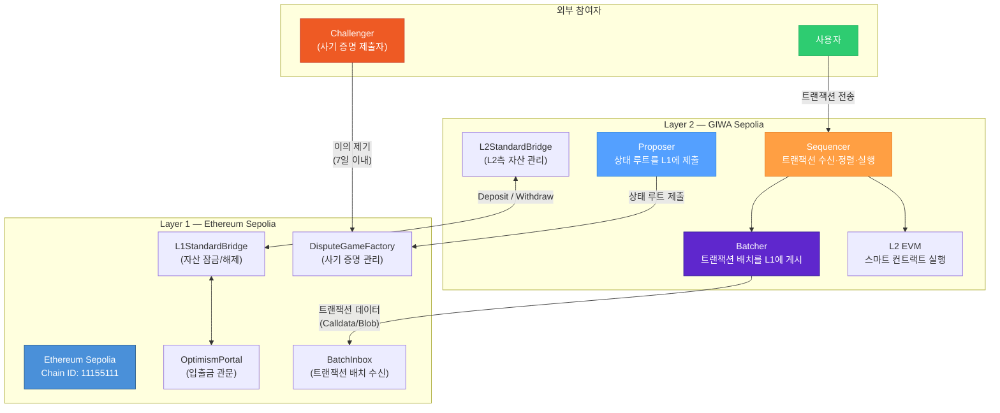
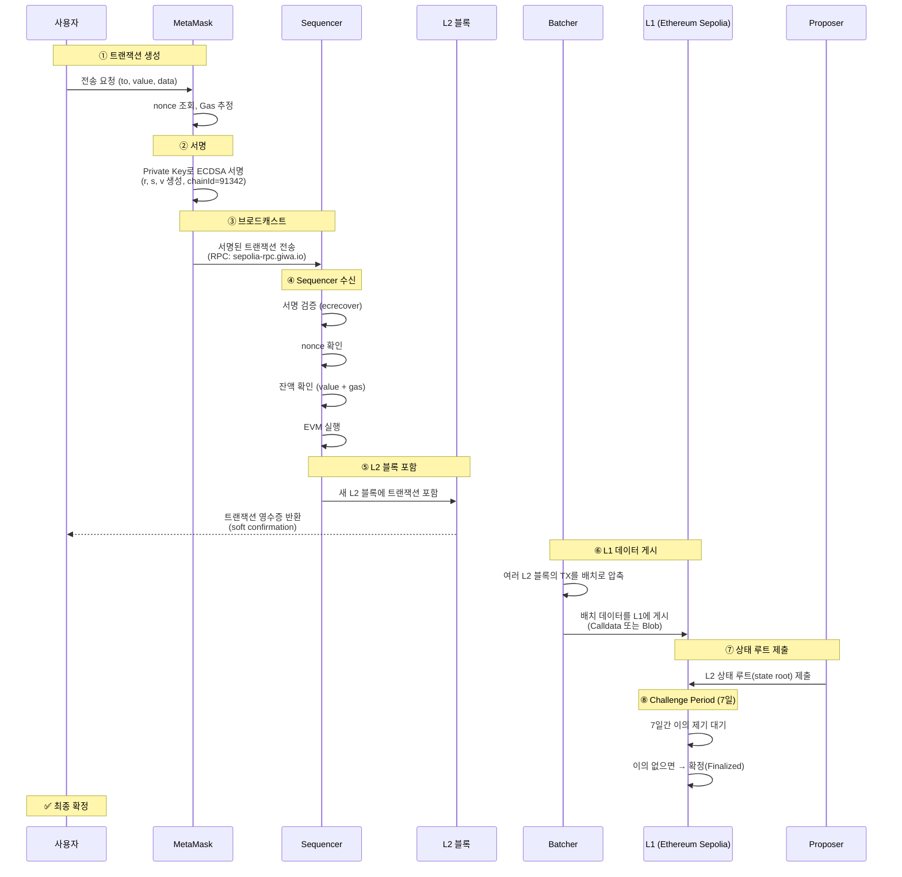
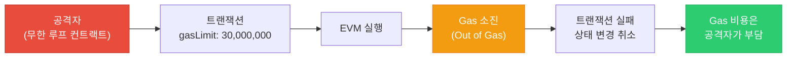
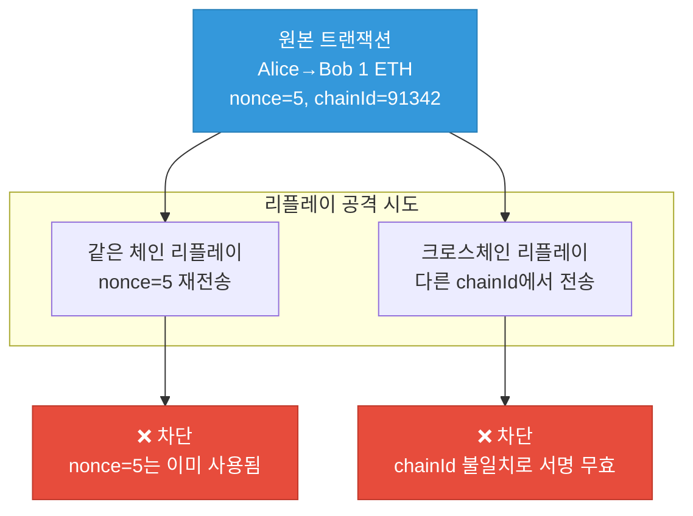
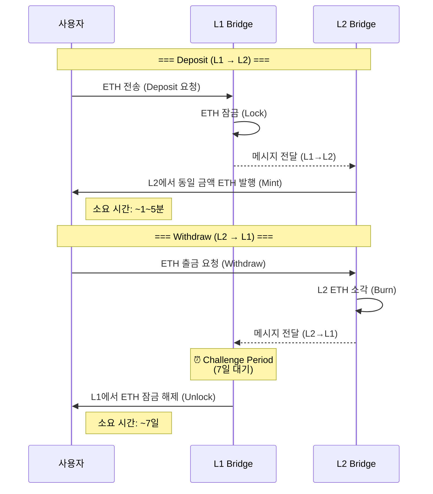
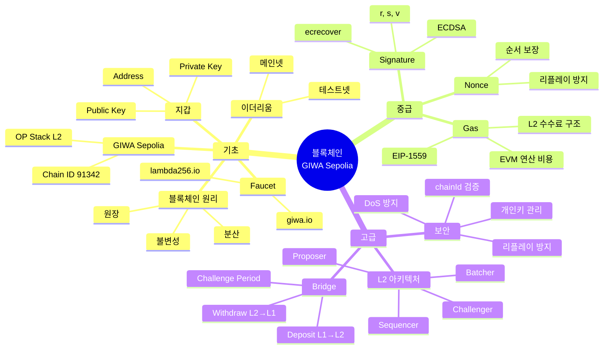
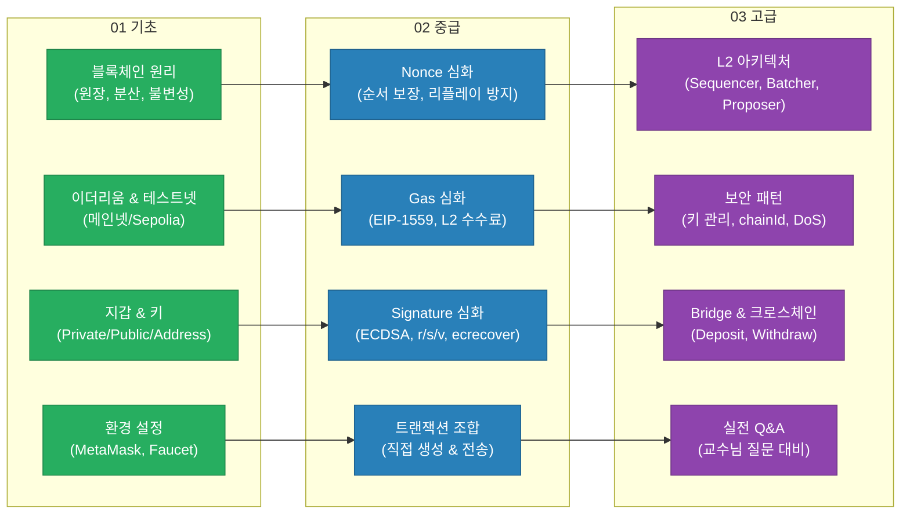

# 03. 고급: L2 아키텍처와 보안

> [!info] 학습 목표
> OP Stack 기반 L2의 전체 아키텍처를 이해하고, 트랜잭션 라이프사이클·보안 패턴·크로스체인 개념을 설명할 수 있다.

**사전 학습**: [[01-기초-블록체인과-GIWA]] → [[02-중급-Nonce-Gas-Signature]]

---

## 0. 왜 L2가 필요한가?

### L1(이더리움)의 현실적 한계

이더리움 메인넷(L1)은 강력한 보안성과 탈중앙화를 자랑하지만, **확장성(Scalability)** 측면에서 명확한 한계가 있다.

| 항목 | 이더리움 L1 현실 | 이상적 수준 |
|------|-----------------|-----------|
| **블록 생성 시간** | ~12초 | 1초 이하 |
| **처리량 (TPS)** | ~15 TPS | 수천~수만 TPS |
| **평균 수수료** | 수 달러~수십 달러 | 0.01달러 이하 |
| **사용자 경험** | 느리고, 비싸고, 답답함 | 빠르고, 저렴하고, 쾌적함 |

> [!tip] 비유 1: 고속도로 정체
> 이더리움 L1은 **왕복 2차선 고속도로**와 같다. 차(트랜잭션)가 몰리면 극심한 정체가 발생하고, 통행료(Gas Fee)가 치솟는다.
> L2는 이 고속도로 옆에 **8차선 우회도로**를 만든 것이다. 대부분의 차량이 우회도로로 빠지면, 정체가 해소되고 통행료도 내려간다. 그리고 우회도로의 최종 정산은 원래 고속도로에서 이루어지므로 **안전성은 그대로** 유지된다.

> [!tip] 비유 2: 본점과 지점
> L1 = **은행 본점**, L2 = **지점(지사)** 이라고 생각하자.
> 본점(L1)에서 모든 고객의 업무를 처리하려면 줄이 길어진다. 그래서 지점(L2)을 여러 개 만들어 **대부분의 업무를 지점에서 처리**하고, **결과 요약만 본점에 보고**한다. 고객은 빠르게 서비스를 받고, 본점은 최종 감사·확인만 담당한다.

### L1만 사용 vs L2 활용 비교

| 비교 항목 | L1만 사용 | L2 활용 (L1 + L2) |
|----------|----------|-------------------|
| **속도** | 12초/블록, 15 TPS | 1~2초/블록, 수천 TPS |
| **수수료** | $1~$50+ (네트워크 혼잡 시) | $0.001~$0.01 |
| **보안** | 이더리움 PoS 직접 보호 | L1 보안을 **상속** (동등한 수준) |
| **사용자 경험** | 느림, 비쌈 | 빠름, 저렴함 |
| **개발 호환성** | EVM 네이티브 | EVM 완전 호환 (코드 수정 불필요) |

> [!info] 핵심 요약
> L2는 L1의 보안을 포기하지 않으면서도, 속도와 비용 문제를 해결하는 **확장 전략**이다. "보안은 L1에 맡기고, 실행은 L2에서 한다"는 것이 핵심 철학이다.

---

## 1. L1 vs L2 아키텍처

### Rollup이란?

**Rollup**은 트랜잭션 실행을 L2에서 수행하되, **트랜잭션 데이터 또는 증명을 L1에 게시**하여 L1의 보안성을 상속받는 확장 기술이다.

| 유형 | 검증 방식 | 대표 프로젝트 |
|------|----------|--------------|
| **Optimistic Rollup** | 사기 증명 (Fraud Proof) — 기본적으로 유효하다고 가정, 이의 제기 시 검증 | Optimism, Base, **GIWA** |
| **ZK Rollup** | 유효성 증명 (Validity Proof) — 매번 수학적 증명을 제출 | zkSync, StarkNet, Scroll |

> [!tip] Optimistic의 의미
> "낙관적"이라는 뜻. 트랜잭션이 **유효하다고 낙관적으로 가정**하고, 문제가 있을 때만 Challenge(이의 제기)를 통해 검증한다. 이 덕분에 빠르고 저렴하다.

### Rollup 유형 비유: 성선설 vs 성악설

두 가지 Rollup 유형의 핵심 차이를 직관적으로 이해하기 위해 비유를 활용해 보자.

> [!tip] Optimistic Rollup = "성선설" (사후 검증)
> **"일단 믿고, 문제 있으면 따져본다."**
> - 모든 트랜잭션이 유효하다고 **먼저 가정**한다
> - 7일의 Challenge Period 동안 누구든 이의를 제기할 수 있다
> - 이의가 없으면 확정, 이의가 있으면 사기 증명(Fraud Proof)을 통해 판결
> - 장점: 빠르고 저렴 / 단점: 최종 확정까지 7일 소요

> [!tip] ZK Rollup = "성악설" (사전 검증)
> **"매번 증명서를 제출해야 한다."**
> - 모든 배치에 대해 **수학적 증명(ZK Proof)** 을 함께 제출한다
> - L1은 이 증명을 검증한 뒤에야 트랜잭션을 인정한다
> - 장점: 즉시 확정성 / 단점: 증명 생성 비용이 높고, EVM 호환성 제약

> [!question] "그러면 Optimistic이 덜 안전한 거 아니야?"
> **아니다.** 7일이라는 기간 내에 **누구나(Challenger)** 이의를 제기할 수 있으므로, 부정한 상태가 확정될 가능성은 사실상 없다. "안 따지는 것"이 아니라, "문제가 있을 때만 따지는 것"이다. 보안 수준은 **동등**하며, 단지 **검증 타이밍**이 다를 뿐이다.

### OP Stack 구조



### 각 역할 설명

| 컴포넌트 | 역할 |
|----------|------|
| **Sequencer** | 사용자 트랜잭션을 수신하고, 순서를 정하고, L2 블록을 생성 |
| **Batcher** | L2 트랜잭션 데이터를 압축하여 L1에 게시 (Data Availability 보장) |
| **Proposer** | L2의 상태 루트(state root)를 L1에 제출 |
| **Challenger** | 잘못된 상태 루트에 대해 사기 증명(Fraud Proof)을 제출 |
| **OptimismPortal** | L1↔L2 간 메시지·자산 이동의 관문 |

> [!warning] Sequencer의 중앙화 문제
> 현재 대부분의 OP Stack 체인에서 Sequencer는 **단일 운영자**가 관리한다. 이는 검열 저항성 면에서 약점이 될 수 있다. 다만, L1에 직접 트랜잭션을 제출하는 **Force Inclusion** 메커니즘으로 이를 보완한다.

---

## 2. 트랜잭션 라이프사이클

사용자가 트랜잭션을 보내면 어떤 과정을 거치는지 전체 흐름을 추적한다.



### 확정성 (Finality) 단계

| 단계 | 시점 | 의미 |
|------|------|------|
| **Unsafe** | Sequencer 처리 직후 (~1초) | Sequencer만 보장. L1 게시 전 |
| **Safe** | L1에 데이터 게시 후 (~수 분) | 데이터가 L1에 존재. 재실행 가능 |
| **Finalized** | Challenge Period 경과 후 (~7일) | L1에서 완전히 확정. 되돌릴 수 없음 |

> [!tip] 실용적 관점
> 대부분의 L2 DApp에서는 **Unsafe** 단계에서 이미 트랜잭션 결과를 사용자에게 보여준다. 고액 거래나 Bridge 출금 시에만 Finalized를 기다린다.

---

## 3. GIWA Sepolia vs Ethereum Sepolia 비교

| 항목 | Ethereum Sepolia (L1) | GIWA Sepolia (L2) |
|------|----------------------|-------------------|
| **Chain ID** | `11155111` | `91342` |
| **블록 타임** | ~12초 | ~2초 |
| **평균 수수료** | 0.001~0.01 ETH | 0.00001~0.0001 ETH |
| **확정성** | ~15분 (2 epoch) | ~1초 (soft) / ~7일 (L1 최종) |
| **합의 메커니즘** | PoS (Proof of Stake) | Sequencer (중앙화, L1으로 보안 상속) |
| **RPC URL** | 다양한 공급자 | `https://sepolia-rpc.giwa.io/` |
| **Explorer** | etherscan.io/sepolia | `https://sepolia-explorer.giwa.io` |
| **Faucet** | 다양한 공급자 | `faucet.giwa.io` / `faucet.lambda256.io/giwa-sepolia` |
| **Bridge** | N/A | `https://sepolia-bridge.giwa.io/` |
| **EVM 호환성** | 네이티브 | 완전 호환 (OP Stack) |

> [!info] 핵심 차이
> GIWA Sepolia는 Ethereum Sepolia의 **확장 레이어**다. 더 빠르고, 더 저렴하지만, 최종 보안은 L1에 의존한다.

---

## 4. 보안 패턴

### 4.1 개인키 관리

```typescript
// ❌ 절대 하지 마라
const privateKey = "0xac0974bec39a17e36ba4a6b4d238ff944bacb478cbed5efcae784d7bf4f2ff80";

// ✅ 환경 변수로 관리
import dotenv from "dotenv";
dotenv.config();
const privateKey = process.env.PRIVATE_KEY;
if (!privateKey) throw new Error("PRIVATE_KEY 환경 변수가 설정되지 않았습니다");
```

> [!warning] 개인키 보안 체크리스트
> - [ ] `.env` 파일에 저장
> - [ ] `.gitignore`에 `.env` 추가
> - [ ] 테스트넷 전용 계정 사용 (메인넷 계정과 분리)
> - [ ] 하드코딩된 키가 코드에 없는지 확인
> - [ ] 커밋 히스토리에 키가 노출된 적 없는지 확인

### 4.2 chainId 검증

> [!warning] chainId를 왜 검증해야 하는가?
> chainId가 없거나 잘못되면, **다른 체인에서 동일한 서명을 재사용**할 수 있다. 예: GIWA에서 보낸 트랜잭션을 Ethereum Mainnet에서 재실행하는 공격.

```typescript
// 트랜잭션 전송 전 chainId 검증
const network = await provider.getNetwork();
const expectedChainId = 91342n;

if (network.chainId !== expectedChainId) {
  throw new Error(
    `잘못된 네트워크! 예상: ${expectedChainId}, 실제: ${network.chainId}`
  );
}
```

### 4.3 DoS 방지 — Gas의 역할



> [!tip] Gas가 DoS를 방지하는 원리
> - 모든 연산에 Gas 비용이 부과되므로, 무한 루프는 **gasLimit에 도달하면 강제 중단**
> - 실패하더라도 Gas 비용은 차감 → 공격 비용 발생
> - Block Gas Limit이 있어 한 블록에서 사용할 수 있는 총 Gas가 제한

### 4.4 리플레이 방지 — Nonce의 역할



### 4.5 초보자가 자주 하는 실수 TOP 5

> [!danger] 반드시 피해야 할 보안 실수 5가지

**1. 개인키를 코드에 직접 입력 (하드코딩)**

```typescript
// ❌ 이렇게 하면 GitHub에 키가 노출된다
const key = "0xac0974bec...";

// ✅ 환경 변수(.env)를 사용하라
const key = process.env.PRIVATE_KEY;
```

> 개인키가 코드에 있으면, Git에 push하는 순간 **전 세계에 공개**된다. 봇이 자동으로 감지하여 수 초 내에 자산을 탈취한다.

**2. `.env` 파일을 Git에 커밋**

```bash
# ✅ .gitignore에 반드시 추가
echo ".env" >> .gitignore

# 확인: .env가 추적되고 있지 않은지 검사
git status
```

> `.env`를 한 번이라도 커밋하면, `git log`에 영구적으로 남는다. 나중에 `.gitignore`에 추가해도 **이미 커밋된 기록은 삭제되지 않는다**. 이 경우 키를 즉시 교체해야 한다.

**3. 테스트넷 키를 메인넷에서도 사용**

> 테스트넷 키는 "연습용"이므로 보안 관리가 느슨한 경우가 많다. 동일한 키를 메인넷에서 사용하면, 테스트넷에서의 부주의한 노출이 **실제 자산 손실**로 이어진다. **반드시 분리하라.**

**4. 낯선 사이트에 개인키 입력 (피싱)**

> 어떤 웹사이트도 개인키(Private Key)를 직접 입력하라고 요구하지 않는다. 만약 요구한다면, **100% 피싱 사이트**다. 정상적인 DApp은 MetaMask 같은 지갑을 통해 서명만 요청한다.

**5. 서명 요청 내용을 확인하지 않고 승인**

> MetaMask에서 "서명 요청" 팝업이 뜨면, **반드시 내용을 읽어라.** 악의적인 DApp은 `approve(MAX_UINT256)` 같은 무제한 토큰 승인을 요청하여 나중에 자산을 빼갈 수 있다. 승인 전에 "무엇을, 얼마나, 누구에게" 허용하는지 반드시 확인하라.

| 순위 | 실수 | 결과 | 예방법 |
|------|------|------|--------|
| 1 | 개인키 하드코딩 | 키 노출 → 자산 탈취 | `.env` 사용 |
| 2 | `.env` 커밋 | Git 히스토리에 영구 기록 | `.gitignore` 확인 |
| 3 | 테스트넷/메인넷 키 혼용 | 테스트넷 노출 → 메인넷 피해 | 키 분리 관리 |
| 4 | 피싱 사이트에 키 입력 | 즉시 자산 탈취 | 절대 키 직접 입력 금지 |
| 5 | 서명 내용 미확인 | 무제한 승인 → 자산 유출 | 서명 내용 항상 확인 |

---

## 5. Bridge와 크로스체인

### L1 ↔ L2 자산 이동



### Bridge를 비유로 이해하기

> [!tip] Deposit (L1 → L2) 비유: 본점에 돈을 맡기면, 지점에서 인출
> **"본점(L1)에 100만 원을 맡기면, 지점(L2)에서 즉시 같은 금액을 인출할 수 있다."**
> - 본점(L1)이 "돈을 받았다"고 확인만 하면 되므로, **1~5분**이면 충분하다
> - 본점의 확인은 신뢰할 수 있으므로 (L1 = 최종 진실), 추가 검증이 불필요하다

> [!tip] Withdraw (L2 → L1) 비유: 지점에서 돌려받으려면 7일 대기
> **"지점(L2)에서 돈을 인출하고 본점(L1)으로 돌려받으려면, 7일간 대기해야 한다."**
> - 왜? 지점의 장부가 정확한지 **본점이 직접 확인할 수 없기 때문**이다
> - 7일 동안 "지점 장부에 문제가 있다"고 이의 제기할 수 있는 기간을 두는 것이다
> - 아무도 이의를 제기하지 않으면 → 정상으로 간주 → 본점에서 자산 지급

> [!question] 왜 입금은 빠르고 출금은 느린가? (비대칭 구조)
> **입금(L1→L2)**: L1이 "확인했다"고 하면 끝이다. L1은 최종 권위이므로 의심할 필요가 없다.
> **출금(L2→L1)**: L2의 주장("이 사용자가 이만큼의 자산을 가지고 있다")이 **정말 맞는지** 검증할 시간이 필요하다. Optimistic Rollup은 "일단 믿되 이의 제기 기간을 둔다"는 방식이므로, 7일이라는 검증 기간이 생기는 것이다.

### GIWA Bridge

| 항목 | 정보 |
|------|------|
| **Bridge URL** | [https://sepolia-bridge.giwa.io/](https://sepolia-bridge.giwa.io/) |
| **Deposit (L1→L2)** | ~1~5분 |
| **Withdraw (L2→L1)** | ~7일 (Challenge Period) |
| **지원 자산** | ETH (기본), ERC-20 토큰 |

> [!warning] Challenge Period (7일)
> L2→L1 출금 시 **7일의 대기 기간**이 있다. 이 기간 동안 누구나 잘못된 상태 전이에 대해 이의를 제기할 수 있다. 이 기간이 지나야 L1에서 자산을 수령할 수 있다.

> [!tip] 왜 7일이나 기다려야 하는가?
> Optimistic Rollup은 "트랜잭션이 유효하다고 가정"하는 방식이다. 만약 Sequencer가 잘못된 상태를 제출했다면, Challenger가 이를 감지하고 사기 증명을 제출할 시간이 필요하다. 7일은 충분한 감지·대응 시간을 보장하기 위한 설계다.

---

## 6. 심화 Q&A (교수님 질문 대비)

> [!example] Q1. "Optimistic Rollup이 ZK Rollup보다 나은 점은?"
> **A:** Optimistic Rollup은 EVM과 완전 호환되어 기존 Solidity 코드를 **수정 없이** 배포할 수 있다. ZK Rollup은 ZK 회로로의 변환이 필요하여 호환성 제약이 있다. 또한 Optimistic은 구현이 상대적으로 단순하고, 생태계가 더 성숙해 있다. 반면 ZK Rollup은 Challenge Period 없이 즉시 확정성을 제공한다는 장점이 있다.
>
> **비유:** Optimistic Rollup = **무인매장** (CCTV로 사후 단속). 고객이 자유롭게 물건을 가져가지만, 도둑이 잡히면 처벌받는다. ZK Rollup = **공항 보안검색** (매번 검사). 탑승 전에 반드시 검색을 통과해야 하므로 느리지만, 위험 물품이 기내에 절대 들어가지 않는다.

> [!example] Q2. "Sequencer가 트랜잭션을 검열하면 어떻게 되나?"
> **A:** OP Stack은 **Force Inclusion** 메커니즘을 제공한다. 사용자가 L1의 OptimismPortal 컨트랙트에 직접 트랜잭션을 제출하면, Sequencer가 이를 무시할 수 없다. 일정 시간이 지나면 L2에 강제로 포함된다. 따라서 Sequencer가 검열하더라도 **사용자는 L1을 통해 탈출**할 수 있다.
>
> **비유:** 택배 회사(Sequencer)가 내 택배를 안 보내주면? 그러면 **우체국(L1)에 직접 가서 보낸다** (Force Inclusion). 택배 회사가 아무리 거부해도, 우체국은 국가가 운영하므로 누구든 이용할 수 있다. L1이 바로 그 "누구도 막을 수 없는 우체국" 역할이다.

> [!example] Q3. "L2에서 Gas가 싼 이유는?"
> **A:** L2에서의 연산 자체는 Sequencer 한 대가 처리하므로 합의 비용이 없다. 비용의 대부분은 L1에 데이터를 게시하는 **L1 Data Fee**다. 이 데이터를 여러 트랜잭션이 공유(배치)하므로, 개별 트랜잭션당 L1 비용이 나뉘어 저렴해진다. EIP-4844 (Blob) 도입 이후 L1 데이터 비용이 더욱 감소했다.
>
> **비유:** **카풀**과 같다. 혼자 차를 타면 고속도로 통행료를 전액 부담하지만, 4명이 카풀하면 1인당 비용이 1/4로 줄어든다. L2의 배치(Batch)는 수백~수천 개의 트랜잭션이 하나의 차(배치)에 함께 타는 것이므로, 개별 비용이 극적으로 감소한다.

> [!example] Q4. "Challenge Period 중에 실제로 사기 증명이 성공한 적이 있는가?"
> **A:** 메인넷에서 아직 사기 증명이 실행되어 Rollup이 되돌려진 적은 없다. 이는 (1) Sequencer가 정직하게 운영되고 있고, (2) 사기 증명 시스템이 억제력(deterrent)으로 작용하기 때문이다. 다만 이는 "사기 증명이 필요 없었다"는 의미이지, "시스템이 불필요하다"는 의미가 아니다. 보안 메커니즘은 사용되지 않을 때 가장 성공적이다.
>
> **비유:** **건물의 소화기**와 같다. 한 번도 사용한 적이 없더라도, 소화기가 **존재한다는 사실 자체**가 방화범이 감히 불을 지르지 못하게 만든다. "사용되지 않은 소화기 = 쓸모없는 소화기"가 아니라, "사용할 필요가 없었던 소화기 = 가장 성공적인 소화기"인 것이다.

> [!example] Q5. "GIWA Sepolia에서 배포한 컨트랙트를 메인넷에 그대로 배포할 수 있는가?"
> **A:** **코드 자체**는 그대로 사용할 수 있다 (EVM 호환). 다만 **설정값**을 변경해야 한다:
> - Chain ID: 91342 → 메인넷 Chain ID
> - RPC URL: `sepolia-rpc.giwa.io` → 메인넷 RPC
> - 컨트랙트 주소: 테스트넷 주소 → 메인넷 주소
> - 환경 변수: 테스트넷 키 → 메인넷 키 (절대 같은 키 사용 금지!)
>
> 또한 메인넷 배포 전에는 **보안 감사(Audit)** 를 받는 것을 강력히 권장한다.
>
> **비유:** **연습 경기 → 본 경기**와 같다. 전술(코드)은 동일하지만, 유니폼(설정값)을 바꿔 입는다. 연습 경기에서 입은 연습복(테스트넷 키)을 본 경기(메인넷)에서 그대로 입으면 안 되듯이, **키와 설정은 반드시 분리**해야 한다.

> [!example] Q6. "EIP-4844 이전과 이후 L2 수수료 차이는?"
> **A:** EIP-4844(Dencun 업그레이드)는 **Blob** 이라는 새로운 데이터 저장 공간을 도입했다. 이전에는 Calldata(영구 저장)에 데이터를 게시했지만, Blob은 ~18일 후 삭제되는 임시 저장소다. 이로 인해 L1 데이터 비용이 **10~100배 감소**했다. L2 전체 수수료도 이에 비례하여 크게 하락했다.
>
> **비유:** **영구 보관 창고 → 임시 보관함**으로 바꾼 것이다. 이전(Calldata)에는 모든 데이터를 영구 보관 창고에 넣어야 해서 임대료가 비쌌다. EIP-4844 이후(Blob)에는 ~18일만 보관하는 임시 보관함을 사용하므로, 비용이 크게 줄어든다. 어차피 Rollup 데이터는 한번 검증되면 영구 보관할 필요가 없기 때문이다.

> [!example] Q7. "L2에서 블록 재구성(Reorg)이 발생할 수 있는가?"
> **A:** L2 자체에서는 Sequencer가 단일 주체이므로 전통적인 Reorg는 발생하지 않는다. 다만 L1에서 Reorg가 발생하면, L1에 게시된 L2 배치 데이터도 영향받을 수 있다. 이것이 **Safe vs Finalized** 구분이 존재하는 이유다. Safe 상태는 L1에 게시되었지만 L1 자체가 아직 확정되지 않은 상태를 의미한다.
>
> **비유:** **지점 장부 vs 본점 장부**와 같다. 지점(L2) 장부가 바뀌려면, 먼저 본점(L1) 장부가 바뀌어야 한다. 본점 장부가 확정(Finalized)되면 지점 장부도 확정되고, 본점 장부가 수정(Reorg)되면 지점 장부도 영향을 받을 수 있다. 그래서 "본점 확정 전까지는 Safe, 본점 확정 후에야 Finalized"인 것이다.

---

## 7. 전체 개념 맵



---

## 8. 전체 학습 로드맵

3개 문서를 관통하는 학습 흐름을 한눈에 정리한다. 각 단계는 이전 단계의 개념을 기반으로 확장된다.

```
기초 (01)              중급 (02)                고급 (03)
━━━━━━━━━━━━━━━━━━━━━━━━━━━━━━━━━━━━━━━━━━━━━━━━━━━━━━━━━━━━━━━━━━━━
블록체인이란?  ──────→  Nonce 심화  ──────────→  L2 아키텍처
이더리움/테스트넷  ──→  Gas 심화  ───────────→  보안 패턴
지갑/키  ─────────→  Signature 심화  ────→  Bridge/크로스체인
환경 설정  ────────→  트랜잭션 조합  ─────→  실전 Q&A
```



> [!info] 학습 순서 가이드
> 1. **기초 (01)** 를 먼저 읽고 환경 설정을 완료한다
> 2. **중급 (02)** 에서 트랜잭션의 핵심 구성 요소를 이해한다
> 3. **고급 (03, 이 문서)** 에서 L2 아키텍처와 보안을 학습한다
>
> 각 문서는 독립적으로도 읽을 수 있지만, **순서대로 학습하면 개념 간 연결이 훨씬 명확**해진다.

---

## 참고 링크

| 자료 | URL |
|------|-----|
| GIWA Sepolia Explorer | [https://sepolia-explorer.giwa.io](https://sepolia-explorer.giwa.io) |
| GIWA Sepolia Bridge | [https://sepolia-bridge.giwa.io](https://sepolia-bridge.giwa.io) |
| GIWA Faucet | [https://faucet.giwa.io](https://faucet.giwa.io) |
| Lambda256 Faucet | [https://faucet.lambda256.io/giwa-sepolia](https://faucet.lambda256.io/giwa-sepolia) |
| OP Stack 공식 문서 | [https://docs.optimism.io](https://docs.optimism.io) |
| EIP-1559 설명 | [https://eips.ethereum.org/EIPS/eip-1559](https://eips.ethereum.org/EIPS/eip-1559) |
| EIP-4844 설명 | [https://eips.ethereum.org/EIPS/eip-4844](https://eips.ethereum.org/EIPS/eip-4844) |

---

## 이전 문서

- [[01-기초-블록체인과-GIWA]] — 블록체인 기초, GIWA 소개, 환경 설정
- [[02-중급-Nonce-Gas-Signature]] — Nonce, Gas, Signature 심화
