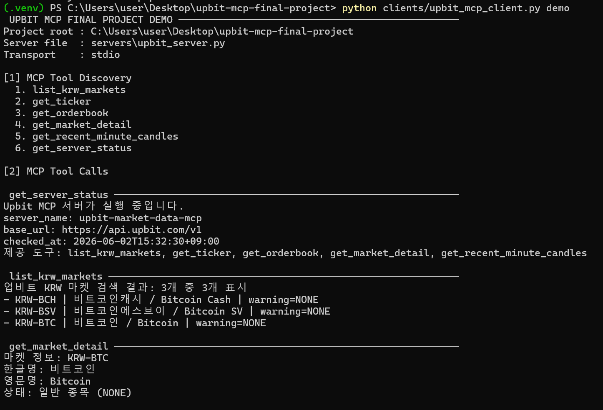
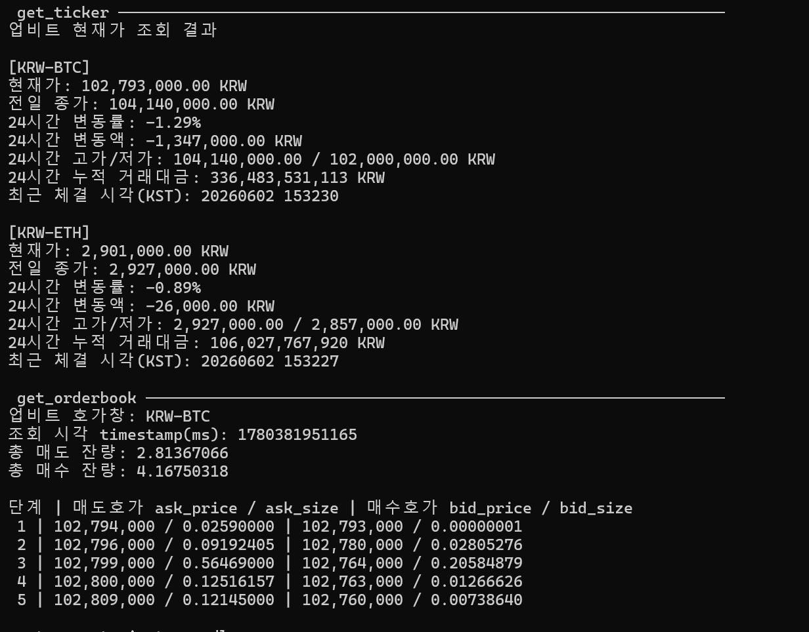
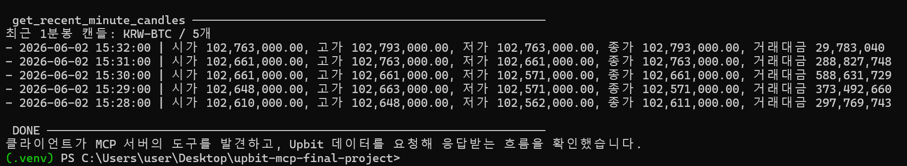

# Upbit MCP 기반 코인 데이터 조회 프로그램

## 1. 과제 개요

이 프로젝트는 기말고사 과제 요구사항에 맞춰 제작한 **Upbit 데이터 조회용 MCP(Model Context Protocol) 서버/클라이언트 프로그램**입니다.

MCP 서버는 Upbit Quotation REST API를 호출하여 코인 현재가, 주문장/호가창, 마켓 정보, 최근 분봉 데이터를 가져옵니다. MCP 클라이언트는 stdio 방식으로 서버에 연결한 뒤, 서버가 제공하는 tool을 발견하고 호출하여 데이터를 확인합니다.

> 이 프로젝트는 조회 전용입니다. 주문, 매수, 매도, 입출금 기능은 포함하지 않았습니다.

---

## 2. 구현 기능

| 구분 | MCP Tool | 설명 |
|---|---|---|
| 서버 상태 | `get_server_status` | MCP 서버 실행 상태와 기준 URL 확인 |
| 마켓 목록 | `list_krw_markets` | Upbit 원화 마켓 목록 조회 및 키워드 검색 |
| 마켓 상세 | `get_market_detail` | 특정 마켓의 한글명, 영문명, 유의 종목 여부 조회 |
| 현재가 | `get_ticker` | 현재가, 전일 종가, 24시간 변동률, 고가/저가, 거래대금 조회 |
| 호가창 | `get_orderbook` | 매도/매수 호가, 잔량, 총 잔량 조회 |
| 캔들 | `get_recent_minute_candles` | 최근 분봉 OHLCV 데이터 조회 |

---

## 3. 폴더 구조

```text
upbit-mcp-final-project/
├── clients/
│   └── upbit_mcp_client.py      # MCP 클라이언트
├── docs/
│   ├── report_kr.md             # 제출용 설명 문서
│   └── demo_script_kr.md        # 발표/시연 대본
├── scripts/
│   └── run_demo.sh              # macOS/Linux용 데모 실행 스크립트
├── servers/
│   └── upbit_server.py          # MCP 서버
├── .gitignore
├── pyproject.toml
├── requirements.txt
└── README.md
```

---

## 4. 설치 방법

### 4.1 Python 버전

Python 3.11 이상을 권장합니다.

```bash
python --version
```

### 4.2 가상환경 생성

#### Windows PowerShell

```powershell
python -m venv .venv
.\.venv\Scripts\activate
pip install -r requirements.txt
```

#### macOS / Linux

```bash
python3 -m venv .venv
source .venv/bin/activate
pip install -r requirements.txt
```

---

## 5. 실행 방법

### 5.1 전체 데모 실행

```bash
python clients/upbit_mcp_client.py demo
```

실행하면 다음 흐름이 출력됩니다.

1. MCP 클라이언트가 서버를 stdio 방식으로 실행합니다.
2. 클라이언트가 서버와 MCP 세션을 초기화합니다.
3. 클라이언트가 서버의 tool 목록을 조회합니다.
4. 클라이언트가 현재가, 호가창, 마켓 정보 등을 요청합니다.
5. 서버가 Upbit API에서 데이터를 받아 클라이언트로 반환합니다.

### 5.2 Tool 목록만 확인

```bash
python clients/upbit_mcp_client.py tools
```

### 5.3 특정 Tool 직접 호출

#### 비트코인 현재가 조회

```bash
python clients/upbit_mcp_client.py call get_ticker markets=KRW-BTC
```

#### 비트코인과 이더리움 현재가 동시 조회

```bash
python clients/upbit_mcp_client.py call get_ticker markets=KRW-BTC,KRW-ETH
```

#### 비트코인 호가창 10단계 조회

```bash
python clients/upbit_mcp_client.py call get_orderbook market=KRW-BTC depth=10
```

#### KRW 마켓에서 비트코인 검색

```bash
python clients/upbit_mcp_client.py call list_krw_markets keyword=비트코인 limit=10
```

#### 최근 1분봉 5개 조회

```bash
python clients/upbit_mcp_client.py call get_recent_minute_candles market=KRW-BTC unit=1 count=5
```

---

## 6. 제출 시 설명할 핵심 구조

```text
[MCP Client]
   │
   │ 1. 서버 실행 및 MCP 세션 초기화
   ▼
[MCP Server]
   │
   │ 2. get_ticker / get_orderbook 등의 Tool 호출
   ▼
[Upbit Quotation REST API]
   │
   │ 3. JSON 데이터 반환
   ▼
[MCP Server]
   │
   │ 4. 사람이 읽기 쉬운 문자열로 정리
   ▼
[MCP Client]
```

이 구조에서 MCP 서버는 외부 API를 감싸는 도구 제공자 역할을 하고, MCP 클라이언트는 서버가 제공하는 도구를 찾아 호출하는 사용자 측 프로그램 역할을 합니다.

---

## 7. 주의사항

- 인터넷 연결이 필요합니다.
- Upbit 공개 시세 조회 API만 사용하므로 API Key가 필요하지 않습니다.
- 너무 빠르게 반복 호출하면 Upbit API 요청 제한에 걸릴 수 있습니다.
- 이 프로그램은 투자 판단이나 자동매매용이 아니라, MCP 기반 데이터 조회 과제 제출용입니다.

---

## 8. 참고 자료

- Upbit Developer Center: Quotation API
- Model Context Protocol Python SDK

---

## 실행 결과 캡처

아래 캡처는 MCP 클라이언트가 MCP 서버를 stdio 방식으로 실행하고, 서버의 tool 목록을 발견한 뒤 Upbit 데이터를 요청해 응답받는 흐름을 확인한 결과입니다.

### 1. MCP Tool Discovery



### 2. Upbit 현재가 및 호가창 조회



### 3. 최근 분봉 캔들 조회 및 실행 완료


